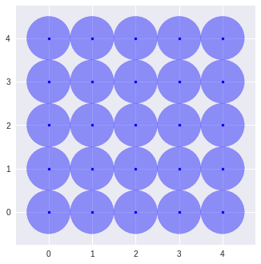
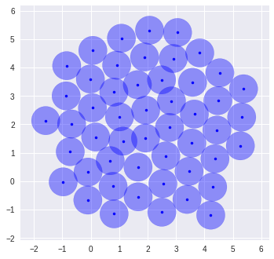

# CBMOS

CBMOS is a Python framework for the numerical analysis of center-based models.
It focuses on flexibility and ease of use and is capable of simulating up to a
few thousand cells within a few seconds, or even up to 10,000 cells if GPU
support is available. CBMOS shines best for exploratory tasks and prototyping,
for instance when one wants to compare different sets of parameters or solvers.
At the moment, it implements most popular force functions, a few first and
second-order explicit solvers, and even one implicit solver.

## Installation
CBMOS is available on PyPI and can be installed through:
```
pip install cbmos
```

## Getting started
### Initial condition

Setting up the initial condition of a simulation is very simple, all you need is create a list of cell objects. In this example we set up a Cartesian grid of 25 cells. Each cell will immediately divides after the simulation starts. We then define a simple plotting function to show the current cell configuration.


```python
import numpy as np
import matplotlib.pyplot as plt

import cbmos
import cbmos.force_functions as ff
import cbmos.solvers.euler_forward as ef
import cbmos.cell as cl

n_x = 5
n_y = 5
cell_size = 0.5
coordinates = [
    (2*cell_size*i_x, 2*cell_size*i_y)
    for i_x in range(n_x) for i_y in range(n_y)
]

sheet = [
    cl.Cell(
        i, # Cell ID, must be unique to each cell
        [x,y], # Initial coordinates
        -6.0, # Birthtime, in this case 6 hours before the simulation starts
        True, # Whether or not the cell is proliferating
        lambda t: 6 + t # Function generating the next division time
    )
    for i, (x, y) in enumerate(coordinates)
]
```


```python
def plot_population(cell_list, color='blue'):
    fig=plt.figure()
    ax=fig.add_subplot(1,1,1)
    for cell in cell_list:
        ax.add_patch(plt.Circle(cell.position ,0.5,color=color, alpha=0.4))
        plt.plot(cell.position[0], cell.position[1], '.', color=color)
    ax.set_aspect('equal')
    plt.show()
    
plot_population(sheet)
```



### Simulation

In this simulation, we use the Gls force and the Euler forward solver. The force function's parameters are given to the simulate function as a dictionary. Parameters can also be passed to the solver in the same way. This function returns a tuple containing the time points and a list of cells for each of these time points.


```python
# Initialize solver
solver = cbmos.CBMModel(ff.Gls(), ef.solve_ivp, dimension=2)
```

```python
dt = 0.01
t_data = np.arange(0, 4, dt)

t_data, history = solver.simulate(
    sheet, # Initial cell configuration
    t_data, # Times at which the history is saved
    {"mu": 5.70, "s": 1.0, "rA": 1.5}, # Force parameters
    {'dt': dt}, # Solver parameters
)
```

```python
plot_population(history[-1])
```




## Documentation
The package's documentation, as well as a few examples are available at
[somathias.github.io/cbmos/](https://somathias.github.io/cbmos/)

## Publications

- Mathias, S., Coulier, A., Bouchnita, A. et al. Impact of Force Function
  Formulations on the Numerical Simulation of Centre-Based Models. Bull Math
  Biol 82, 132 (2020). [DOI](https://doi.org/10.1007/s11538-020-00810-2) (tag `exp-Mathias2020`)
