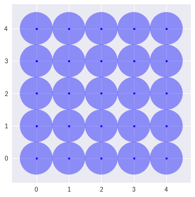
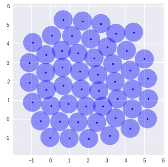

# CBMOS

CBMOS is a Python framework for the numerical analysis of center-based models.
It focuses on flexibility and ease of use and is capable of simulating up to a
few thousand cells within a few seconds, or even up to 10,000 cells if GPU
support is available. CBMOS shines best for exploratory tasks and prototyping,
for instance when one wants to compare different sets of parameters or solvers.
At the moment, it implements most popular force functions, a few first and
second-order explicit solvers, and even one implicit solver.

## Installation
CBMOS is available on PyPI and can be installed through:
```
pip install cbmos
```

## Getting Started
### Initial condition

Setting up the initial condition of a simulation is very simple, all you need is create a list of cell objects. In this example we set up a Cartesian grid of 25 cells. Each cell will immediately divides after the simulation starts. This behavior is defined by the list of `CellDivisionEvent` objects. We then plot the current cell configuration using the basic plotting function provided in the `utils` module.


```python
import numpy as np
import matplotlib.pyplot as plt

import cbmos
import cbmos.force_functions as ff
import cbmos.solvers.euler_forward as ef
import cbmos.cell as cl
import cbmos.utils as utils
import cbmos.events as events

n_x = 5
n_y = 5
coordinates = utils.generate_cartesian_coordinates(n_x, n_y)

sheet = [
    cl.ProliferatingCell(
        i, # Cell ID, must be unique to each cell
        [x,y], # Initial coordinates
        -6.0, # Birthtime, in this case 6 hours before the simulation starts
        True, # Whether or not the cell is proliferating
        lambda t: 6 + t # Function generating the next division time
    )
    for i, (x, y) in enumerate(coordinates)
]

event_list = [
    events.CellDivisionEvent(cell)
    for cell in sheet
]
```


```python
utils.plot_2d_population(sheet)
```



### Simulation

In this simulation, we use the Gls force and the Euler forward solver. The force function's parameters are given to the simulate function as a dictionary. Parameters can also be passed to the solver in the same way. This function returns a tuple containing the time points and a list of cells for each of these time points. If needed a detailed log of the division events can be displayed by [setting the log level](https://docs.python.org/3/howto/logging.html) to `debug`.


```python
# Initialize model
model = cbmos.CBModel(ff.Gls(), ef.solve_ivp, dimension=2)

dt = 0.01
t_data = np.arange(0, 4, dt)

t_data, history = model.simulate(
    sheet, # Initial cell configuration
    t_data, # Times at which the history is saved
    {"mu": 5.70, "s": 1.0, "rA": 1.5}, # Force parameters
    {'dt': dt}, # Solver parameters
    event_list=event_list
)
```


```python
utils.plot_2d_population(history[-1])
```





## Documentation
The package's documentation, as well as a few examples are available at
[somathias.github.io/cbmos/](https://somathias.github.io/cbmos/)

## Publications

- Mathias, S., Coulier, A., Bouchnita, A. et al. Impact of Force Function
  Formulations on the Numerical Simulation of Centre-Based Models. Bull Math
  Biol 82, 132 (2020). [DOI](https://doi.org/10.1007/s11538-020-00810-2) (tag `exp-Mathias2020`)
- Mathias, S., Coulier, A. & Hellander, A. CBMOS: a GPU-enabled Python
  framework for the numerical study of center-based models. BMC Bioinformatics
  23, 55 (2022). [DOI](https://doi.org/10.1186/s12859-022-04575-4) (tag `exp-Mathias2022`)
